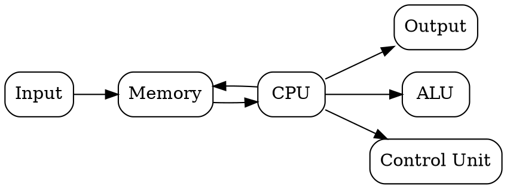
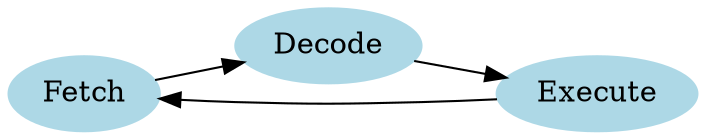
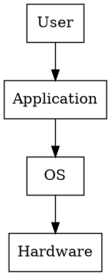

# Module: 1

# Basic Organization of Stored Program Computer

---
# 1️⃣ Stored Program Computer Organization

## 📌 Introduction

The **Stored Program Concept** is the foundation of modern computers.
It means **instructions (program) and data are stored in the same memory**.

This idea was proposed by **John von Neumann**, so it is also called the **Von Neumann Architecture**.

💡 Instead of rewiring hardware for every task, the computer simply **loads a program into memory and executes it**.

---

## ⚙️ Core Components of Stored Program Computer

A computer system mainly consists of **five basic units**:

| Component                   | Function                                   |
| --------------------------- | ------------------------------------------ |
| Input Unit                  | Takes input from user                      |
| Memory Unit                 | Stores instructions and data               |
| Control Unit (CU)           | Controls execution of instructions         |
| Arithmetic Logic Unit (ALU) | Performs calculations and logic operations |
| Output Unit                 | Displays results                           |

---

## 🧠 Block Diagram



---

## 🧩 CPU Components

CPU has two main parts:

### 1️⃣ Control Unit (CU)

Controls instruction execution.

Functions:

* Fetch instruction
* Decode instruction
* Control ALU operations
* Manage memory communication

### 2️⃣ Arithmetic Logic Unit (ALU)

Performs:

* Arithmetic operations ➜ `+ - * /`
* Logical operations ➜ `AND OR NOT`

---

## 💡 Real Life Analogy

Think of a **restaurant kitchen** 🍽️

| Computer | Kitchen             |
| -------- | ------------------- |
| Program  | Recipe              |
| CPU      | Chef                |
| Memory   | Ingredients storage |
| Input    | Order from customer |
| Output   | Prepared food       |

---

## 🧠 Tips to Memorize

Remember **IMACO**

```
I → Input
M → Memory
A → ALU
C → Control Unit
O → Output
```

---

## ⚠️ Common Mistakes

❌ Thinking **ALU controls program execution**
✔ Control Unit actually does this.

❌ Thinking **data and program are separate memory**
✔ In stored program concept, **same memory stores both**.

---

## 📌 Exam Tip

Most exam questions ask:

**"Explain Stored Program Computer with diagram."**

Always include:

* Definition
* Components
* Diagram
* Von Neumann mention

---

## 🔁 Quick Revision

* Proposed by **John von Neumann**
* **Program + Data stored in same memory**
* Main units: **Input, Memory, ALU, CU, Output**
* Basis of modern computers

---

# 2️⃣ Operation Sequence for Execution of a Program

## 📌 Introduction

A computer executes programs through a **series of steps called the Instruction Cycle**.

The CPU repeatedly performs:

```
Fetch → Decode → Execute
```

This is called the **Instruction Execution Cycle**.

---

## 🔄 Instruction Cycle Diagram



---

## ⚙️ Steps in Program Execution

### 1️⃣ Fetch

CPU retrieves instruction from memory.

Steps:

1. Program Counter contains instruction address
2. Instruction loaded into Instruction Register

---

### 2️⃣ Decode

Control Unit interprets the instruction.

Example:

```
ADD R1, R2
```

Meaning:

```
R1 = R1 + R2
```

---

### 3️⃣ Execute

ALU performs the operation.

Example:

* Addition
* Data transfer
* Logical operation

---

## 📦 Important Registers

| Register                  | Function                    |
| ------------------------- | --------------------------- |
| PC (Program Counter)      | Address of next instruction |
| IR (Instruction Register) | Stores current instruction  |
| MAR                       | Memory address register     |
| MDR                       | Memory data register        |

---

## 💡 Real Life Analogy

Imagine **reading a recipe** 🍳

1️⃣ Fetch → Read next step
2️⃣ Decode → Understand instruction
3️⃣ Execute → Perform cooking step

---

## 🧠 Memory Trick

Remember:

```
FDE Cycle
Fetch
Decode
Execute
```

---

## ⚠️ Common Mistakes

❌ Fetching data instead of instruction
✔ Fetch stage always retrieves **instruction first**

❌ Assuming execution happens before decoding

Correct order:

```
Fetch → Decode → Execute
```

---

## 🔁 Quick Revision

* CPU follows **Instruction Cycle**
* Steps: **Fetch → Decode → Execute**
* Important registers: **PC, IR, MAR, MDR**

---

# 3️⃣ Role of Operating System and Compiler/Assembler

## 📌 Introduction

Hardware alone cannot run programs efficiently.

Software layers like **Operating System and Compiler** help convert and manage programs.

---

# 🖥️ Role of Operating System

Operating System acts as **interface between user and hardware**.

Examples:

* Windows
* Linux
* macOS

---

## ⚙️ OS Functions

| Function           | Explanation              |
| ------------------ | ------------------------ |
| Process Management | Manages running programs |
| Memory Management  | Allocates RAM            |
| File Management    | Handles files            |
| Device Management  | Controls hardware        |
| Security           | Protects system          |

---

## 📊 OS Layer Diagram



---

# 🧾 Role of Compiler

A **Compiler converts high-level language into machine code**.

Example:

```
C Program → Machine Code
```

Steps:

1. Lexical analysis
2. Syntax analysis
3. Code generation

---

# 🔧 Role of Assembler

Assembler converts:

```
Assembly Language → Machine Language
```

Example:

```
MOV AX,BX
```

Converted into binary instruction.

---

## 🧠 Comparison Table

| Feature    | Compiler            | Assembler         |
| ---------- | ------------------- | ----------------- |
| Input      | High level language | Assembly language |
| Output     | Machine code        | Machine code      |
| Complexity | High                | Low               |

---

## 💡 Easy Analogy

| Component    | Example                       |
| ------------ | ----------------------------- |
| User         | Person speaking English       |
| Compiler     | Translator                    |
| Machine Code | Language computer understands |

---

## 🔁 Quick Revision

* OS manages **hardware and resources**
* Compiler → **High level → Machine**
* Assembler → **Assembly → Machine**

---

# 4️⃣ Operators, Operands, Registers and Storage

## 📌 Definitions

### 🔧 Operator

An **operation to be performed**.

Example:

```
ADD
SUB
MUL
```

---

### 📦 Operand

The **data on which operation is performed**.

Example:

```
ADD R1,R2
```

Operator = ADD
Operands = R1, R2

---

### 🧠 Registers

Registers are **small high-speed storage inside CPU**.

Used for:

* Temporary data storage
* Fast processing

Examples:

| Register    | Use                      |
| ----------- | ------------------------ |
| Accumulator | Stores results           |
| PC          | Next instruction address |
| IR          | Current instruction      |

---

### 💾 Storage Types

| Type      | Speed     | Example     |
| --------- | --------- | ----------- |
| Registers | Fastest   | CPU         |
| Cache     | Very fast | L1/L2       |
| RAM       | Fast      | Main memory |
| Disk      | Slow      | HDD/SSD     |

---

## 🔁 Quick Revision

* **Operator → Operation**
* **Operand → Data**
* **Register → Fast CPU memory**

---

# 5️⃣ Instruction Format

## 📌 Definition

Instruction format defines **how an instruction is represented in binary**.

---

## 🧩 General Format

```
| Opcode | Operand | Address |
```

| Field   | Meaning         |
| ------- | --------------- |
| Opcode  | Operation       |
| Operand | Data            |
| Address | Memory location |

---

## 📊 Example

Instruction:

```
ADD R1,R2
```

Binary structure:

```
Opcode | Register1 | Register2
```

---

## 🔁 Quick Revision

Instruction consists of:

```
Opcode + Operand
```

---

# 6️⃣ Instruction Sets & Addressing Modes

## 📌 Instruction Set

The **complete set of instructions a CPU can execute**.

Examples:

| Type          | Example |
| ------------- | ------- |
| Data transfer | MOV     |
| Arithmetic    | ADD     |
| Logical       | AND     |
| Control       | JUMP    |

---

# 📍 Addressing Modes

Addressing mode defines **how operand location is determined**.

---

## Types

### 1️⃣ Immediate Addressing

Value is directly inside instruction.

Example:

```
MOV A,5
```

---

### 2️⃣ Direct Addressing

Address given directly.

```
LOAD A,500
```

---

### 3️⃣ Register Addressing

Operand stored in register.

```
ADD R1,R2
```

---

### 4️⃣ Indirect Addressing

Register contains address of operand.

---

## 🧠 Easy Memory Trick

```
DIRI

D → Direct
I → Immediate
R → Register
I → Indirect
```

---

# 7️⃣ Number Systems

## Types

| System      | Base |
| ----------- | ---- |
| Binary      | 2    |
| Octal       | 8    |
| Decimal     | 10   |
| Hexadecimal | 16   |

---

## Binary Example

```
1011₂ = 11₁₀
```

---

# 8️⃣ Fixed and Floating Point Representation

## 📌 Fixed Point

Decimal point is fixed.

Example:

```
123.45
```

Advantages:

* Simple
* Fast

Disadvantages:

* Limited range

---

## 📌 Floating Point

Decimal point **moves dynamically**.

Example:

```
3.45 × 10²
```

Used in:

* Scientific calculations
* Graphics
* AI

---

## Comparison

| Feature   | Fixed | Floating |
| --------- | ----- | -------- |
| Range     | Small | Large    |
| Precision | Low   | High     |

---

# 🧠 FINAL ULTRA-FAST REVISION

⭐ Stored program → Program + Data in same memory

⭐ CPU = ALU + Control Unit

⭐ Instruction Cycle → **Fetch → Decode → Execute**

⭐ OS manages hardware


⭐ Compiler → High level → Machine code

⭐ Instruction = Opcode + Operand

⭐ Addressing modes → Immediate, Direct, Register, Indirect

⭐ Number systems → Binary, Octal, Decimal, Hex

⭐ Floating point → large numbers

---

✅ **Most Frequently Asked Exam Topics**

🔥 Stored Program Computer Architecture

🔥 Fetch Decode Execute Cycle

🔥 Addressing Modes

🔥 Instruction Format

🔥 Fixed vs Floating Point Representation

---