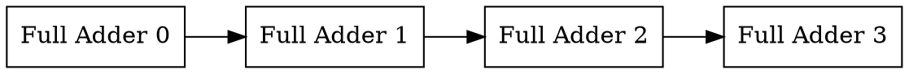
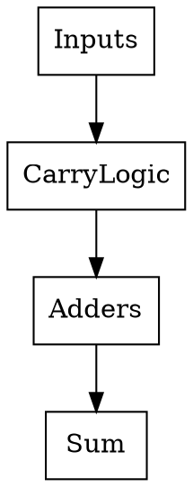
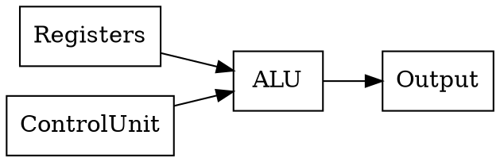
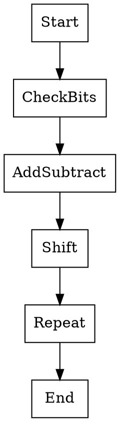
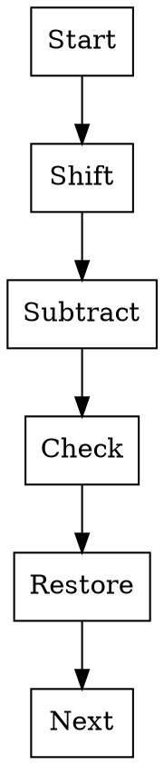
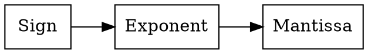

# Module 2
# Arithmetic Operations & ALU

---

# 1️⃣ Overflow and Underflow

## 📌 Introduction

In computer arithmetic, numbers are stored using **limited bits** (like 8-bit, 16-bit, 32-bit).

Sometimes a result becomes **too large or too small to represent**, which leads to:

⚠️ **Overflow**
⚠️ **Underflow**

---

## 🔴 Overflow

Overflow occurs when a **result exceeds the maximum limit** of the number representation.

Example (4-bit signed numbers)

Range:

```
-8  to  +7
```

Example calculation:

```
7 + 3 = 10
```

But maximum representable value is **7**

➡ Result cannot be stored → **Overflow occurs**

---

### 💡 Example

Binary example (4-bit):

```
0111  (7)
+0011 (3)
---------
1010
```

The result exceeds the range → **Overflow**

---

## 🔵 Underflow

Underflow occurs when the result becomes **smaller than the minimum representable value**.

Example:

```
-8 - 3 = -11
```

But minimum allowed value is **-8**

➡ **Underflow occurs**

---

## 🧠 Real-Life Analogy

Think of a **glass of water** 🥤

| Situation                   | Meaning   |
| --------------------------- | --------- |
| Water spills out            | Overflow  |
| Too little water to measure | Underflow |

---

## ⚠️ Common Mistakes

❌ Confusing overflow with carry
✔ Carry does **not always mean overflow**

---

## 🧠 Memory Tip

```
Overflow → number too BIG
Underflow → number too SMALL
```

---

## 🔁 Quick Revision

* Overflow → result too large
* Underflow → result too small
* Happens due to **limited bit storage**

🔥 **Very common exam question**

---

# 2️⃣ Design of Adders

Adders are digital circuits used for **binary addition**.

Two important types:

1️⃣ Ripple Carry Adder
2️⃣ Carry Look Ahead Adder

---

# 2.1️⃣ Ripple Carry Adder (RCA)

## 📌 Introduction

A **Ripple Carry Adder** adds multi-bit numbers using **multiple full adders connected in series**.

The carry from one adder **ripples to the next**.

---

## ⚙️ Working Principle

Example: **4-bit addition**

```
A3 A2 A1 A0
B3 B2 B1 B0
```

Each bit is added using a **full adder**.

---

## 📊 Ripple Carry Diagram



Carry flows like this:

```
C0 → C1 → C2 → C3 → C4
```

---

## ⚠️ Disadvantage

Ripple carry causes **delay**.

Because each adder must wait for **previous carry**.

---

## 🧠 Real-Life Analogy

Like **people passing a message in a line**.

Each person waits before passing it.

➡ Slow process.

---

## 🔁 Summary

✔ Simple design
❌ Slow due to carry delay

---

# 2.2️⃣ Carry Look Ahead Adder (CLA)

## 📌 Introduction

To solve ripple carry delay, **Carry Look Ahead Adder** predicts carry **in advance**.

This significantly **reduces delay**.

---

## ⚙️ Principle

Uses two signals:

| Symbol | Meaning   |
| ------ | --------- |
| P      | Propagate |
| G      | Generate  |

Formulas:

```
Pi = Ai ⊕ Bi
Gi = Ai · Bi
```

Carry equation:

```
Ci+1 = Gi + PiCi
```

---

## 📊 CLA Structure



---

## ✔ Advantages

✔ Much faster
✔ Reduces carry propagation delay

---

## ❌ Disadvantages

❌ More complex hardware

---

## 📊 Comparison Table

| Feature    | Ripple Carry | Carry Look Ahead |
| ---------- | ------------ | ---------------- |
| Speed      | Slow         | Fast             |
| Complexity | Low          | High             |
| Delay      | High         | Low              |

---

## 🔁 Quick Revision

* Ripple Carry → simple but slow
* Carry Look Ahead → fast but complex

🔥 **Highly asked exam topic**

---

# 3️⃣ Design of ALU

## 📌 Introduction

ALU stands for **Arithmetic Logic Unit**.

It performs:

* Arithmetic operations
* Logical operations

---

## ⚙️ Operations Performed

### Arithmetic

```
ADD
SUB
MUL
DIV
```

### Logical

```
AND
OR
NOT
XOR
```

---

## 📊 ALU Block Diagram



---

## ⚙️ Components of ALU

| Component    | Function                  |
| ------------ | ------------------------- |
| Adder        | Performs addition         |
| Logic unit   | Performs logic operations |
| Registers    | Store operands            |
| Control unit | Selects operation         |

---

## 💡 Real Life Analogy

Think of ALU as a **calculator inside CPU** 🧮.

---

## 🔁 Quick Revision

* ALU = Arithmetic + Logic
* Core part of CPU

---

# 4️⃣ Fixed Point Multiplication – Booth's Algorithm

## 📌 Introduction

Booth's Algorithm is used to **multiply signed binary numbers efficiently**.

It reduces number of addition operations.

---

## ⚙️ Principle

Booth examines **two bits at a time**:

```
Current bit + Previous bit
```

| Bit Pattern | Operation             |
| ----------- | --------------------- |
| 00          | No operation          |
| 11          | No operation          |
| 01          | Add multiplicand      |
| 10          | Subtract multiplicand |

---

## 📊 Booth Algorithm Flow



---

## ✔ Advantages

✔ Faster multiplication
✔ Efficient for signed numbers

---

## 🔁 Quick Revision

Booth algorithm uses:

```
01 → ADD
10 → SUBTRACT
00 / 11 → NOTHING
```

🔥 **Important exam question**

---

# 5️⃣ Fixed Point Division

Two algorithms:

1️⃣ Restoring Division
2️⃣ Non-Restoring Division

---

# 5.1️⃣ Restoring Division

## 📌 Principle

After subtraction, if result becomes negative, the previous value is **restored**.

Steps:

1. Shift left
2. Subtract divisor
3. If result negative → restore
4. Set quotient bit

---

## 📊 Flow



---

# 5.2️⃣ Non-Restoring Division

## 📌 Principle

Instead of restoring immediately, algorithm **adjusts in next step**.

---

## ✔ Advantage

✔ Faster than restoring division

---

## 📊 Comparison

| Feature    | Restoring | Non-Restoring |
| ---------- | --------- | ------------- |
| Speed      | Slower    | Faster        |
| Complexity | Simple    | Complex       |

---

# 6️⃣ Floating Point – IEEE 754 Standard

## 📌 Introduction

Floating point numbers represent **very large or very small numbers**.

Standard used: **IEEE 754**

---

## ⚙️ IEEE 754 Format (32-bit)

```
| Sign | Exponent | Mantissa |
```

| Field    | Bits |
| -------- | ---- |
| Sign     | 1    |
| Exponent | 8    |
| Mantissa | 23   |

---

## 📊 Diagram



---

## ✔ Example

Number:

```
-5.75
```

Stored as:

```
Sign + Exponent + Mantissa
```

---

## ✔ Advantages

✔ Large range
✔ High precision

---

## ⚠️ Common Mistake

Students forget **bit distribution**.

Remember:

```
1 | 8 | 23
```

---

## 🧠 Memory Trick

```
S E M

Sign
Exponent
Mantissa
```

---

# 🧠 ULTRA FAST REVISION (Module 2)

⭐ Overflow → result too large

⭐ Underflow → result too small

⭐ Ripple Carry Adder → slow

⭐ Carry Look Ahead → fast

⭐ ALU → arithmetic + logical operations

⭐ Booth Algorithm → efficient signed multiplication

⭐ Division → Restoring / Non-Restoring

⭐ IEEE 754 → floating point format

```
1 bit sign
8 bit exponent
23 bit mantissa
```

---

# 🔥 Most Important Exam Topics (Very Frequently Asked)

1️⃣ Ripple Carry vs Carry Look Ahead Adder

2️⃣ Booth Multiplication Algorithm

3️⃣ Restoring vs Non-Restoring Division

4️⃣ IEEE 754 Floating Point Representation

5️⃣ Overflow and Underflow

---
