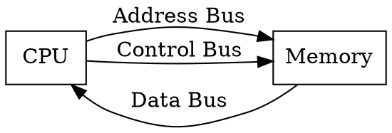
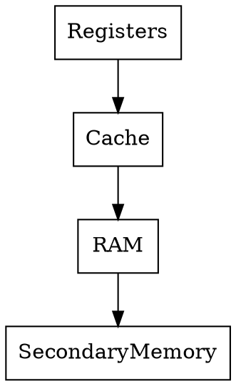
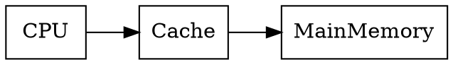
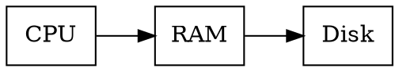
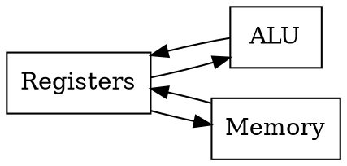

# Module 3
# Memory Organization & CPU–Memory Interfacing

---

# 1️⃣ Memory Unit Design & CPU–Memory Interfacing

## 📌 Introduction

The **memory unit** stores:

* Instructions (program)
* Data used during program execution

The **CPU must communicate with memory** to:

* Read instructions
* Read data
* Write results

This communication is called **CPU–Memory Interfacing**.

---

## ⚙️ Components Involved

| Component | Function                             |
| --------- | ------------------------------------ |
| CPU       | Processes instructions               |
| Memory    | Stores data and instructions         |
| Buses     | Carry signals between CPU and memory |

---

## 🧠 Types of Buses

### 1️⃣ Address Bus

Carries **memory address from CPU to memory**

Example:

```text
CPU → Address 2000 → Memory
```

---

### 2️⃣ Data Bus

Transfers **actual data between CPU and memory**

Example:

```text
Memory → Data → CPU
```

---

### 3️⃣ Control Bus

Carries control signals like:

* Read
* Write
* Interrupt

---

## 📊 CPU–Memory Interface Diagram



---

## ⚙️ Memory Read Operation

Steps:

1️⃣ CPU sends **memory address**

2️⃣ CPU activates **READ signal**

3️⃣ Memory sends **data to CPU**

---

## ⚙️ Memory Write Operation

Steps:

1️⃣ CPU sends **address**

2️⃣ CPU sends **data**

3️⃣ CPU activates **WRITE signal**

4️⃣ Data stored in memory

---

## 🧠 Memory Trick

Remember:

```text
ADR → Address Bus
DAT → Data Bus
CON → Control Bus
```

ADR–DAT–CON

---

## ⚠️ Common Mistakes

❌ Mixing **address bus and data bus**

✔ Address bus → address only
✔ Data bus → actual data

---

## 🔁 Quick Revision

* CPU and memory communicate using **buses**
* Three buses: **Address, Data, Control**
* Used for **read and write operations**

🔥 **Very common theory question**

---

# 2️⃣ Memory Organization

## 📌 Introduction

Memory organization defines **how data is stored and accessed in memory**.

Memory consists of **many storage locations**.

Each location has a **unique address**.

---

## 📦 Example

Memory with **8 locations**

| Address | Data |
| ------- | ---- |
| 000     | 15   |
| 001     | 22   |
| 010     | 7    |
| 011     | 10   |

CPU accesses data using **address**.

---

## 🧠 Key Features

✔ Sequential storage
✔ Addressable locations
✔ Fast access

---

## 🔁 Quick Revision

Memory = **collection of addressable storage cells**

---

# 3️⃣ Static Memory vs Dynamic Memory

Two important RAM types:

1️⃣ **SRAM (Static RAM)**
2️⃣ **DRAM (Dynamic RAM)**

---

## 3.1️⃣ Static RAM (SRAM)

### 📌 Definition

SRAM stores data using **flip-flops**.

It **does not need refreshing**.

---

### ✔ Features

* Very fast
* Expensive
* Used in **cache memory**

---

### ⚙️ Structure

Each cell uses **6 transistors**.

---

## 3.2️⃣ Dynamic RAM (DRAM)

### 📌 Definition

DRAM stores data using **capacitors**.

Data must be **refreshed periodically**.

---

### ✔ Features

* Slower than SRAM
* Cheaper
* Used as **main memory**

---

## 📊 Comparison Table

| Feature | SRAM         | DRAM        |
| ------- | ------------ | ----------- |
| Speed   | Very fast    | Slower      |
| Cost    | Expensive    | Cheap       |
| Refresh | Not required | Required    |
| Usage   | Cache        | Main memory |

---

## 🧠 Memory Trick

```text
S → SRAM → Speed
D → DRAM → Dense (large capacity)
```

---

## 🔁 Quick Revision

SRAM → Fast, expensive
DRAM → Cheap, large capacity

🔥 **Very frequently asked**

---

# 4️⃣ Memory Hierarchy

## 📌 Introduction

Computers use **multiple memory levels** arranged by:

* Speed
* Cost
* Capacity

This structure is called **Memory Hierarchy**.

---

## 📊 Memory Hierarchy Pyramid



---

## 📊 Levels of Memory

| Level            | Speed     | Example       |
| ---------------- | --------- | ------------- |
| Registers        | Fastest   | CPU registers |
| Cache            | Very fast | L1, L2        |
| Main Memory      | Medium    | RAM           |
| Secondary Memory | Slow      | HDD/SSD       |

---

## 💡 Concept

Closer to CPU → **Faster but smaller**

Far from CPU → **Slower but larger**

---

## 🧠 Easy Analogy

Think of studying:

| Memory    | Example                        |
| --------- | ------------------------------ |
| Registers | What you're thinking right now |
| Cache     | Notes on desk                  |
| RAM       | Books on shelf                 |
| Disk      | Library                        |

---

## 🔁 Quick Revision

Registers → Cache → RAM → Disk

🔥 **Important exam topic**

---

# 5️⃣ Associative Memory (Content Addressable Memory)

## 📌 Introduction

Associative memory searches data using **content instead of address**.

Also called **CAM (Content Addressable Memory)**.

---

## ⚙️ Working Principle

Instead of:

```text
Find data at address 500
```

It searches:

```text
Find data with value = 20
```

Memory returns matching address.

---

## ✔ Advantages

✔ Very fast search
✔ Parallel comparison

---

## ❌ Disadvantages

❌ Expensive hardware

---

## 🔁 Quick Revision

Associative memory = **search by content**

---

# 6️⃣ Cache Memory

## 📌 Introduction

Cache memory is **small, very fast memory** placed between CPU and RAM.

It stores **frequently used data**.

---

## 📊 Cache Architecture



---

## ⚙️ Why Cache is Needed

CPU speed >> RAM speed

Cache reduces **memory access time**.

---

## 📦 Example

If CPU repeatedly uses:

```text
variable X
```

Cache stores X for faster access.

---

## 🧠 Types of Cache

| Type | Location            |
| ---- | ------------------- |
| L1   | Inside CPU          |
| L2   | Between CPU and RAM |
| L3   | Shared cache        |

---

## 🔁 Quick Revision

Cache = **fast temporary memory for frequently used data**

🔥 **Common exam question**

---

# 7️⃣ Virtual Memory

## 📌 Introduction

Virtual memory allows a system to **use disk space as extra RAM**.

It creates an **illusion of large memory**.

---

## ⚙️ Working Principle

If RAM becomes full:

* Some data moves to **disk**
* Called **paging**

---

## 📊 Virtual Memory Diagram



---

## ✔ Advantages

✔ Run large programs
✔ Efficient memory use

---

## ❌ Disadvantages

❌ Slower than RAM

---

## 🔁 Quick Revision

Virtual memory = **RAM + disk combination**

---

# 8️⃣ Data Path Design for Read/Write Access

## 📌 Introduction

The **data path** defines how data moves between:

* CPU
* Registers
* Memory

---

## 📊 Data Path Diagram



---

## ⚙️ Read Operation

Steps:

1️⃣ Address placed in MAR
2️⃣ Read signal activated
3️⃣ Data transferred to MDR
4️⃣ Data moved to register

---

## ⚙️ Write Operation

Steps:

1️⃣ Address in MAR
2️⃣ Data in MDR
3️⃣ Write signal activated
4️⃣ Data stored in memory

---

## 🧠 Important Registers

| Register | Function                |
| -------- | ----------------------- |
| MAR      | Memory Address Register |
| MDR      | Memory Data Register    |

---

## 🔁 Quick Revision

Read:

```text
Memory → CPU
```

Write:

```text
CPU → Memory
```

---

# 🧠 ULTRA-FAST REVISION (Module 3)

⭐ CPU–Memory communication uses **Address, Data, Control bus**

⭐ SRAM → fast

⭐ DRAM → cheap

⭐ Memory hierarchy:

```text
Registers
Cache
RAM
Disk
```

⭐ Cache → stores frequently used data

⭐ Virtual memory → disk used as RAM

⭐ Associative memory → search by content

---

# 🔥 Most Important Exam Topics

1️⃣ Memory hierarchy

2️⃣ SRAM vs DRAM

3️⃣ Cache memory

4️⃣ Virtual memory

5️⃣ CPU–memory interfacing

6️⃣ Associative memory

---


