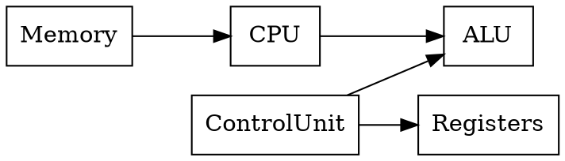
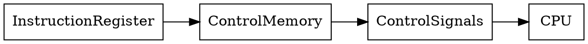
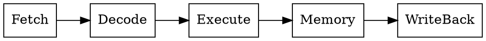
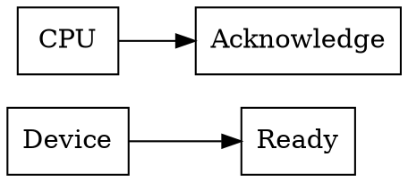
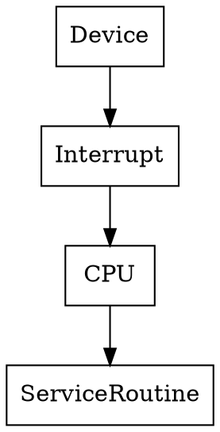
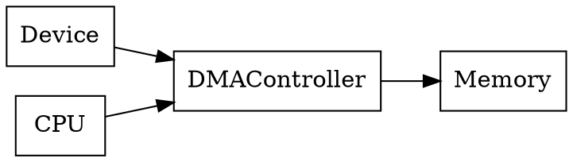

# Module 4
# Control Unit, Pipelining, RISC, and I/O Operations

---

# 1️⃣ Design of Control Unit

## 📌 Introduction

The **Control Unit (CU)** is the component of the CPU that **directs and coordinates all operations** of the computer.

It tells:

* ALU what operation to perform
* Registers when to store data
* Memory when to read/write

It generates **control signals** that control hardware components.

---

## ⚙️ Functions of Control Unit

| Function             | Description                              |
| -------------------- | ---------------------------------------- |
| Instruction decoding | Understands the instruction              |
| Control signals      | Sends signals to hardware                |
| Data movement        | Controls transfer between CPU and memory |
| Execution control    | Ensures correct sequence of operations   |

---

## 📊 Control Unit Position in CPU



---

## 🧠 Types of Control Unit

There are **two main types**:

1️⃣ Hardwired Control Unit
2️⃣ Microprogrammed Control Unit

---

# 1.1️⃣ Hardwired Control Unit

## 📌 Definition

A **Hardwired Control Unit** generates control signals using **fixed digital circuits** like:

* logic gates
* decoders
* flip-flops

The control logic is **built directly into hardware**.

---

## ⚙️ Working Principle

Control signals are produced based on:

* instruction opcode
* clock signal
* processor state

---

## ✔ Advantages

✔ Very fast
✔ Simple execution

---

## ❌ Disadvantages

❌ Difficult to modify
❌ Complex design for large instruction sets

---

## 💡 Example

Used in many **RISC processors**.

---

# 1.2️⃣ Microprogrammed Control Unit

## 📌 Definition

In this design, control signals are generated using **microinstructions stored in control memory**.

Each machine instruction is broken into **micro-operations**.

---

## ⚙️ Working

Steps:

1️⃣ Instruction decoded
2️⃣ Microinstruction fetched from control memory
3️⃣ Control signals generated

---

## 📊 Microprogrammed CU Diagram



---

## ✔ Advantages

✔ Easier to design
✔ Easy to modify

---

## ❌ Disadvantages

❌ Slower than hardwired control

---

## 📊 Comparison Table

| Feature      | Hardwired CU | Microprogrammed CU |
| ------------ | ------------ | ------------------ |
| Speed        | Very fast    | Slower             |
| Flexibility  | Low          | High               |
| Design       | Complex      | Easier             |
| Modification | Difficult    | Easy               |

---

## 🧠 Memory Trick

```text
H → Hardwired → High Speed
M → Microprogrammed → More Flexible
```

---

## 🔁 Quick Revision

* Control Unit generates **control signals**
* Two types: **Hardwired and Microprogrammed**

🔥 **Very important exam question**

---

# 2️⃣ Instruction Pipelining

## 📌 Introduction

Instruction pipelining is a technique used to **increase CPU performance** by executing **multiple instructions simultaneously**.

It works like an **assembly line in a factory**.

---

## ⚙️ Basic Idea

Instead of completing one instruction before starting another:

Multiple instructions are processed **in different stages at the same time**.

---

## 📊 Pipeline Stages

Typical stages:

| Stage      | Description         |
| ---------- | ------------------- |
| Fetch      | Instruction fetched |
| Decode     | Instruction decoded |
| Execute    | Operation performed |
| Memory     | Data access         |
| Write back | Result stored       |

---

## 📊 Pipeline Diagram



---

## 💡 Real Life Analogy

Think of a **car assembly line** 🚗

| Stage   | Example          |
| ------- | ---------------- |
| Stage 1 | Frame built      |
| Stage 2 | Engine installed |
| Stage 3 | Painting         |

Multiple cars are processed **simultaneously**.

---

## ✔ Advantages

✔ Increased CPU throughput
✔ Better hardware utilization

---

## ❌ Problems (Pipeline Hazards)

1️⃣ Data hazard
2️⃣ Structural hazard
3️⃣ Control hazard

---

## 🔁 Quick Revision

Pipeline = **overlapping execution of instructions**

---

# 3️⃣ RISC Architecture

## 📌 Introduction

RISC stands for:

```text
Reduced Instruction Set Computer
```

It uses **simpler and fewer instructions** to improve speed.

---

## ⚙️ Key Characteristics

✔ Simple instructions
✔ Fixed instruction length
✔ Few addressing modes
✔ Fast execution

---

## 💡 Examples

* ARM processors
* MIPS
* RISC-V

---

# 4️⃣ RISC vs CISC Architecture

CISC means:

```text
Complex Instruction Set Computer
```

These processors support **many complex instructions**.

---

## 📊 Comparison Table

| Feature                | RISC   | CISC    |
| ---------------------- | ------ | ------- |
| Instruction count      | Few    | Many    |
| Instruction complexity | Simple | Complex |
| Execution time         | Fast   | Slower  |
| Hardware               | Simple | Complex |

---

## 💡 Examples

| Architecture | Example CPU |
| ------------ | ----------- |
| RISC         | ARM         |
| CISC         | x86         |

---

## 🧠 Memory Trick

```text
RISC → Reduced
CISC → Complex
```

---

## 🔁 Quick Revision

RISC = simple instructions
CISC = complex instructions

---

# 5️⃣ I/O Operations

## 📌 Introduction

Input/Output operations allow **communication between CPU and external devices**.

Examples of I/O devices:

* Keyboard
* Mouse
* Printer
* Hard disk

---

## ⚙️ I/O Data Transfer Methods

1️⃣ Handshaking
2️⃣ Polled I/O
3️⃣ Interrupt
4️⃣ DMA

---

# 5.1️⃣ Handshaking

Handshaking ensures **synchronization between CPU and device**.

Two signals are used:

* Ready signal
* Acknowledge signal

---

## 📊 Handshake Flow



---

# 5.2️⃣ Polled I/O

In this method, the CPU repeatedly **checks device status**.

Example:

```text
Is keyboard ready?
Is keyboard ready?
Is keyboard ready?
```

---

## ✔ Advantage

Simple implementation

---

## ❌ Disadvantage

CPU time wasted

---

# 5.3️⃣ Interrupt Driven I/O

Instead of CPU checking continuously, the **device interrupts the CPU when ready**.

---

## 📊 Interrupt Flow



---

## ✔ Advantage

Efficient CPU utilization

---

# 5.4️⃣ DMA (Direct Memory Access)

DMA allows **devices to transfer data directly to memory without CPU involvement**.

---

## 📊 DMA Structure



---

## ✔ Advantages

✔ Fast data transfer
✔ CPU free for other tasks

---

## 🧠 Memory Trick

```text
HPID

H → Handshaking
P → Polled I/O
I → Interrupt
D → DMA
```

---

# 🧠 ULTRA FAST REVISION (Module 4)

⭐ Control unit types

```text
Hardwired
Microprogrammed
```

⭐ Instruction pipelining → parallel instruction stages

⭐ RISC → simple instructions

⭐ CISC → complex instructions

⭐ I/O methods

```text
Handshaking
Polled
Interrupt
DMA
```

---

# 🔥 Most Important Exam Topics

1️⃣ Hardwired vs Microprogrammed Control Unit

2️⃣ Instruction Pipelining

3️⃣ RISC vs CISC Architecture

4️⃣ DMA vs Interrupt I/O

5️⃣ Handshaking mechanism

---


